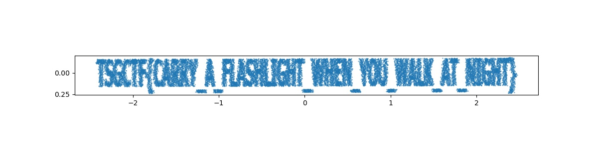

# Graffiti in the fog Writeup

## Author

@dai

## Overview

Flag is drawn in the image. Darker pixels are converted to 4d pointcloud, and perturbed along 2 orthogonal directions. The order of the pointcloud is shuffled.

## Solution

The variances of perturbation is much larger than the actual pointcloud. Process PCA and select 2 components with small variances.

`TSGCTF{CARRY_A_FLASHLIGHT_WHEN_YOU_WALK_AT_NIGHT}`