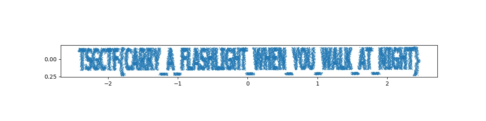

# Graffiti in the fog 解法

## Author

@dai

## Overview

フラグ画像の暗いピクセルが4次元点群に移される。そして直交する二つの方向に摂動を与えられ、点群の順序自体もシャッフルされている。

## Solution

摂動の分散は正解の点群の分散より非常に大きいため、PCAをかけることで見つかる分散の小さな2つの軸に投影することでフラグ画像を復元できる。

`TSGCTF{CARRY_A_FLASHLIGHT_WHEN_YOU_WALK_AT_NIGHT}`